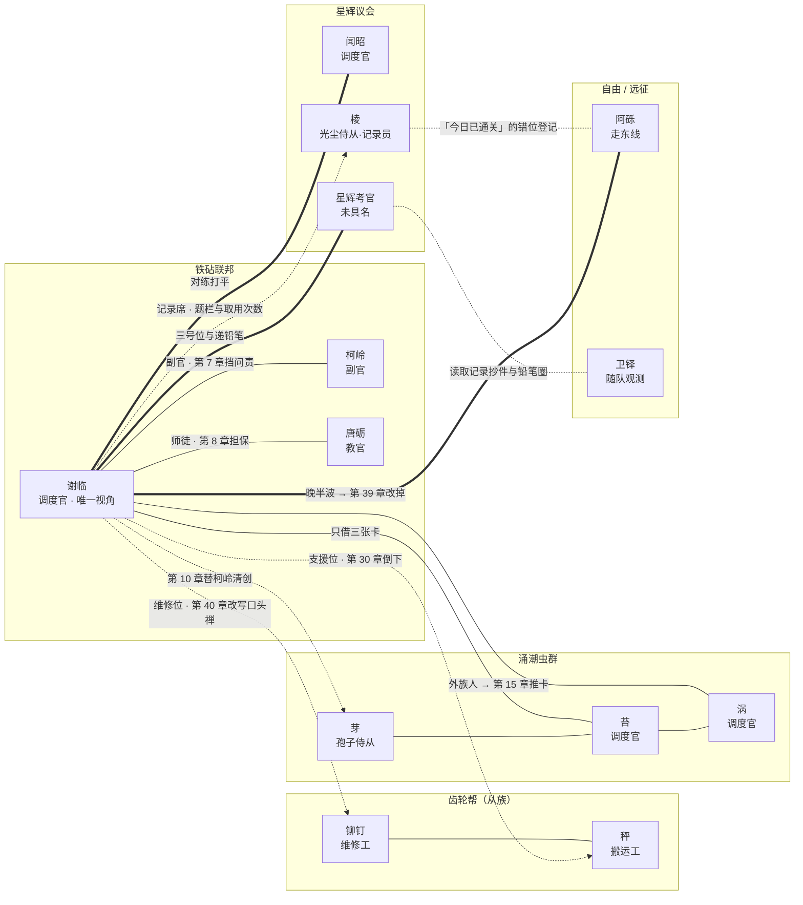

# 《节点之海》人物关系图

> 用途：长篇《节点之海》的人物关系与阵营速查（图 + 表 + 按卷推进）｜ 事实来源：[00_设定圣经](00_设定圣经.md)、[分卷与章节大纲](01_分卷与章节大纲.md) ｜ 配套速查：[人物术语对照卡](../人物术语对照卡.md) ｜ 状态：v1.0 · 2026-09-14

## 一、关系总图

读法：实线＝同僚/合约/盟友，点线＝从族链路，粗线＝对手或竞争关系，点划线＝暗线线索。

## 二、关系轴（逐条对照）

| 关系 | 双方 | 类型 | 关键章 | 一句话 |
| --- | --- | --- | --- | --- |
| 主角—副官 | 谢临 · 柯岭 | 僚属 | 1-01、1-07、5-06 | 报波次、按纸图；她失守时他以值班记录替她挡下问责 |
| 主角—教官 | 谢临 · 唐砺 | 僚属 | 1-01…1-08、4-08 | 「你漏了谁」；他以自己当年的失守记录担保；送行时补全「只有你自己昨天的记录」 |
| 主角—维修工 | 谢临 · 铆钉 | 从族 | 1-04…5-08 | 「修得再好，也带不到明天」→ 第 40 章被改写为「带不到明天，就修到别人手里」 |
| 主角—搬运工 | 谢临 · 秤 | 从族 | 1-04、4-06 | 第 30 章 BOSS 阶段技中倒下，战报把它的类别从「消耗品」改成「人员」 |
| 齿轮帮班组 | 铆钉 · 秤 | 同族 | 1-04…5-08 | 同一支援位班组；秤换过一条铜腿后仍跑在最前 |
| 主角—孢子侍从 | 谢临 · 芽 | 从族 | 2-02…4-05 | 把柯岭身上的腐蚀层数「搬进菌毯」；潮汐三链条的第三格 |
| 主角—涌潮调度官 | 谢临 · 苔 | 借卡 | 2-01、2-03、2-07 | 只借三张卡；章末唯一一句话把卷三的门推开 |
| 主角—涌潮调度官 | 谢临 · 涡 | 对手→同行 | 2-03、2-07 | 当面骂「外族人」，又把三张族专属卡推给她选——她挑了最难用的那张 |
| 涌潮同僚 | 苔 · 涡 | 同族 | 2-01…4-01 | 一个沉默、一个聒噪；签字与不签字都在替涌潮算账 |
| 主角—星辉调度官 | 谢临 · 闻昭 | 盟友 | 3-04、3-08 | 一个信共鸣、一个信账本；对练打平，约定「下次换你的卡组」 |
| 主角—星辉考官 | 谢临 · 星辉考官 | 对手 | 3-01…4-03 | 把她钉在三号位，也在第 19 章递出铅笔；第 27 章唯一没签字的人 |
| 主角—同行 | 谢临 · 阿砾 | 竞争 | 3-06、5-05、5-07 | 「你的支援位放晚了半波」；第 37 章推出东线纸图，第 39 章被证明她已改掉 |
| 主角—记录员 | 谢临 · 棱 | 从族 | 4-05…5-08 | 登记支援位与题栏；第 37 章说明记录片由远征台按编号自动刻录 |
| 暗线：抄件 | 星辉考官 · 卫铎 | 暗线 | 3-07、4-07 | 读取记录的抄件、铅笔圈与缺角棱镜章同源，最终收进坐标证据链 |
| 暗线：错位登记 | 棱 · 阿砾 | 暗线 | 5-05、5-08 | 台按编号补小字，不问那枚片子是哪天刻的，旧账挂在今天底下 |

## 三、按卷推进（每卷新增的关系）

| 卷 | 章 | 新增关系 | 关系形态的变化 |
| --- | --- | --- | --- |
| 卷一《卡匣新兵》 | 1–8 | 谢临—柯岭、谢临—唐砺、谢临—铆钉、谢临—秤 | 从「一个人算账」到「一个哨位有人」；失守换来担保与调令 |
| 卷二《腐蚀的雨季》 | 9–16 | 谢临—芽、谢临—苔、谢临—涡、苔—涡 | 从「借来的卡」到「借来的信任」；跨族一等授权 |
| 卷三《共鸣的间隙》 | 17–24 | 谢临—闻昭、谢临—星辉考官、谢临—阿砾、考官—卫铎 | 从「打一局」到「站一边」；拒签换来自由身与第一名对手 |
| 卷四《三族同台》 | 25–32 | 谢临—棱、三方战时授权、坐标证据链 | 从「三方同台」到「三方共管」；她成了那条被三族共用的线 |
| 卷五《节点之海》 | 33–40 | 谢临—记录席、棱—阿砾（错位登记） | 从「记录自己」到「取用别人」；关系最终落在记录片上 |

## 四、暗线线索链

1. **漏怪的名字**：控制台侧沿（1-02 起）→ 军法席（1-07）→ 卡匣盒盖内侧（5-06）→ 新兵训练台侧沿（5-08）。这条链上的人是柯岭与她自己。
2. **「带不到明天」**：铆钉（1-04）→ 第七格前（5-02）→ 第 36 章他一次也没说 → 第 40 章被她改写。这条链只连着两个人，一机器一人。
3. **读取记录**：卫铎的抄录段号（3-07）→ 铅笔圈（2-06）→ 缺角棱镜章（2-08）→ 星辉考官未签字（4-03）→ 坐标证据（4-07）。全链没有一句指控，只有三份抄件。
4. **记录片**：榜底取用次数（3-05）→ 自动刻录说明（5-05）→ 她取用别人的（5-08）。这条链把「她与阿砾」写成隔着一个赛季的相邻两格。

## 五、与短篇故事集的关系

- 唐砺（01《火线换装》）、闻昭（03《共鸣的间隙》）在长篇中是重要配角，性格与手法与短篇一致；
- 中篇《第八节点》与长篇第 36 章是同一局远征（种子 20260914），区别在于视角：中篇是旁观她的失败，长篇第 36 章是她的内部视角，第 39 章同图新种子通关；
- 铆钉与秤的命名由短篇统一（维修工＝铆钉、搬运工＝秤），详见 [人物术语对照卡](../人物术语对照卡.md)。

---

*（本图为叙事关系图，身份与机制以策划文档为准。）*
