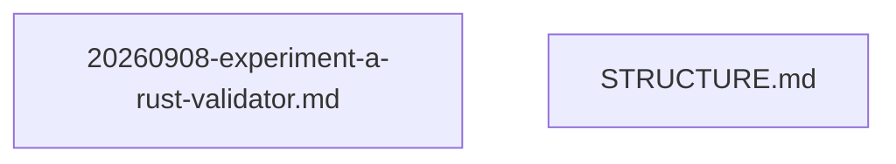

# notes · 目录结构与文件关系

> 目录 `concerns/data-validator/notes` 的说明。属 **目录自描述**（元规则 M4 目录说明与统一索引）：列结构 + 条目说明 + 文件关系图；
> 这类说明由树根 README 末尾统一索引。

## 一、目录结构

```
notes/
    ├─ 20260908-experiment-a-rust-validator.md
    └─ STRUCTURE.md
```

## 二、条目说明

| 条目 | 说明 |
| --- | --- |
| `20260908-experiment-a-rust-validator.md` | 实验笔记 · 实验 A：Rust 数据契约校验器 |
| `STRUCTURE.md` | 目录结构(本文件) |


## 三、文件关系图（mermaid）


