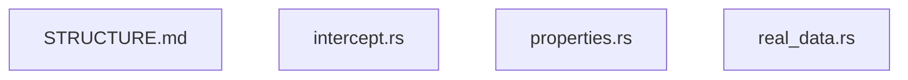

# tests · 目录结构与文件关系

> 目录 `concerns/data-validator/tests` 的说明。属 **目录自描述**（元规则 M4 目录说明与统一索引）：列结构 + 条目说明 + 文件关系图；
> 这类说明由树根 README 末尾统一索引。

## 一、目录结构

```
tests/
    ├─ STRUCTURE.md
    ├─ intercept.rs
    ├─ properties.rs
    └─ real_data.rs
```

## 二、条目说明

| 条目 | 说明 |
| --- | --- |
| `STRUCTURE.md` | 目录结构(本文件) |
| `intercept.rs` | （代码文件） |
| `properties.rs` | （代码文件） |
| `real_data.rs` | （代码文件） |


## 三、文件关系图（mermaid）


