# viz · 目录结构与文件关系

> 目录 `concerns/visual-fallback/viz` 的说明。属 **目录自描述**（元规则 M4 目录说明与统一索引）：列结构 + 条目说明 + 文件关系图；
> 这类说明由树根 README 末尾统一索引。

## 一、目录结构

```
viz/
    ├─ STRUCTURE.md
    ├─ consistency-heatmap.html
    ├─ consistency-heatmap.json
    ├─ data-invariants.html
    ├─ data-invariants.json
    ├─ design-review.html
    ├─ design-review.json
    ├─ doc-health.html
    ├─ doc-health.json
    ├─ index.html
    ├─ meta-compliance.json
    ├─ req-trace.html
    ├─ req-trace.json
    └─ review-ledger.json
```

## 二、条目说明

| 条目 | 说明 |
| --- | --- |
| `STRUCTURE.md` | 目录结构(本文件) |
| `consistency-heatmap.html` | （资源/产物） |
| `consistency-heatmap.json` | （JSON 配置/数据） |
| `data-invariants.html` | （资源/产物） |
| `data-invariants.json` | （JSON 配置/数据） |
| `design-review.html` | （资源/产物） |
| `design-review.json` | （JSON 配置/数据） |
| `doc-health.html` | （资源/产物） |
| `doc-health.json` | （JSON 配置/数据） |
| `index.html` | （资源/产物） |
| `meta-compliance.json` | 配置：lab/formal-system |
| `req-trace.html` | （资源/产物） |
| `req-trace.json` | （JSON 配置/数据） |
| `review-ledger.json` | （JSON 配置/数据） |


## 三、文件关系图（mermaid）

```mermaid
graph TD
    N0[STRUCTURE.md]
    N1[consistency-heatmap.html]
    N2[consistency-heatmap.json]
    N3[data-invariants.html]
    N4[data-invariants.json]
    N5[design-review.html]
    N6[design-review.json]
    N7[doc-health.html]
    N8[doc-health.json]
    N9[index.html]
    N10[meta-compliance.json]
    N11[req-trace.html]
    N12[req-trace.json]
    N13[review-ledger.json]
```


